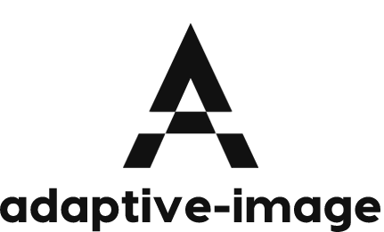

<p align="center">

<div align="center">A image component that adapts to dpr and picture size</div>
</p>

Replace the src path with a picture of the corresponding size according to the size of the picture. For example, if your size is 500, but your picture is 1000, it will automatically be replaced with a picture of 500.

## :book: Install
```
npm i adaptive-image

# import { AdaptiveImage } from 'adaptive-image'
```

## &#x270B; Example
Adapt according to dpr * imageWidth Use the image in size to replace the src path @300

``` vue
  <adaptive-image alt="xx" style="width:200px;" src="http://localhost:3333/public/xx@300.jpg" :size="[300,500,1000]"></adaptive-image>
```

## License
[MIT](./LICENSE) License © 2022 [Simon He](https://github.com/Simon-He95)

<a href="https://github.com/Simon-He95/sponsor" target="_blank"></a>


<span><div align="center"></div></span>
